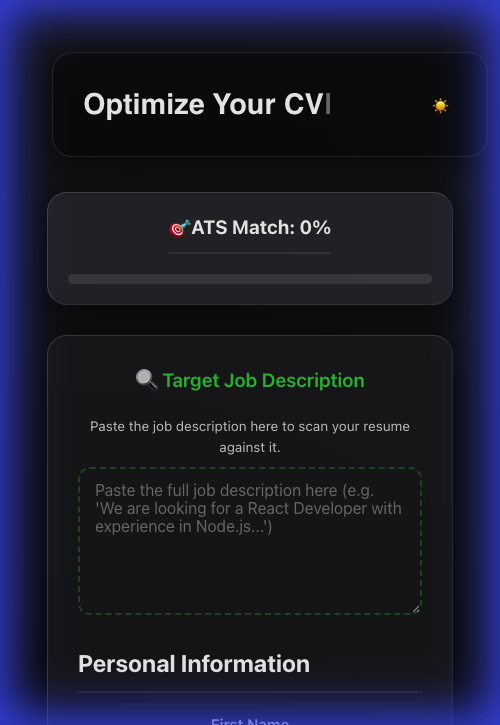
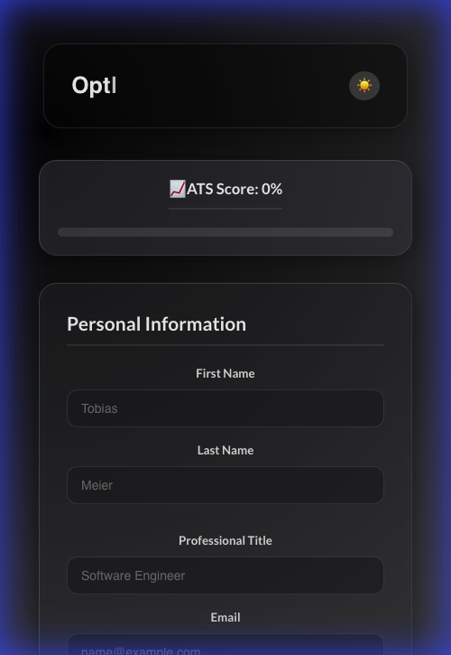

# ATS Resume Builder

ATS Resume Builder is a modern, React-based web application designed to help users create resume that are optimized for Applicant Tracking Systems (ATS). It features real-time ATS score calculation, a live preview, and a beautiful glassmorphism-inspired UI with dark and light mode interaction.

## 🌐 Live Demo

🔗 **Live Site:** 
[https://ats-resume-builder.netlify.app/](https://ats-resume-builder.netlify.app/)

## Features

*   **ATS Score Calculator**: Real-time feedback on your resume's completeness and keyword density.
*   **Live Preview**: See your resume update instantly in an A4 document format as you type.
*   **Glassmorphism UI**: A modern, translucent design aesthetic.
*   **Dark/Light Mode**: Toggle between two distinct, beautiful themes with persistent preferences.
*   **PWA Support**: Installable as a Progressive Web App for offline access.
*   **Dynamic Sections**: Add multiple entries for Experience, Education, Languages, and Certificates.
*   **responsive Design**: Works seamlessly on mobile, tablet, and desktop devices.
*   **Animations**: Smooth fade-in animations for a polished user experience.

## Screenshots

### Light Mode


### Dark Mode


## Technologies Used

*   **React**: Frontend library (using Vite).
*   **Vite**: Build tool and development server.
*   **CSS3**: Custom styling with variables, gradients, and backdrop-filter (no external UI framework dependencies for core components).
*   **Vite PWA**: For Progressive Web App capabilities.
*   **Typewriter-Effect**: For the engaging header text animation.
*   **AOS**: For scroll animations.

## Getting Started

### Prerequisites

*   Node.js (v14 or higher)
*   npm

### Installation

1.  **Clone the repository**

    ```bash
    git clone https://github.com/ajf013/ats-resume-builder.git
    cd ats-resume-builder
    ```

2.  **Install dependencies**

    ```bash
    npm install
    ```

3.  **Run the development server**

    ```bash
    npm run dev
    ```

    The application will start on `http://localhost:3000`.

### Building for Production

To create a production build:

```bash
npm run build
```

The output will be in the `dist` folder.

## Author

**Francis Cruz**
*   [GitHub](https://github.com/ajf013)
*   [LinkedIn](https://www.linkedin.com/in/ajf013-francis-cruz/)

## License

This project is licensed under the MIT License.

## You can reach out 😊😊
Feel free to contact me about the problems. I will try to help as much as I can 😉

[](https://www.linkedin.com/in/ajf013-francis-cruz/)
[](mailto:cruzmma2021@gmail.com)
[](https://github.com/ajf013)